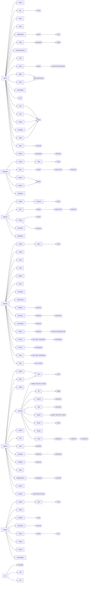

```mermaid
graph LR
    
    game --> check
    game --> join --> A1([name])
    game --> leave
    game --> stats
    game --> leaderboard --> A2([game]) --> A3([count])
    game --> help --> A4([gametype]) --> A5([#page])
    game --> showCategories
    game --> info
    game --> warp --> A6([game]) --> A7([start,finish,#checkpoint])
    game --> allow --> A8([allow permissions])
    game --> deny --> A8
    game --> switchables
    game --> UNICODE_TEXT(end)
    game --> kick --> A9([player])
    game --> ban --> A9
    game --> unban --> A9
    game --> manager --> A9
    game --> invite --> A9
    game --> timer --> A10([seconds])
    game --> delete --> A11([gametype]) --> A12([filename])
    
    HSgame --> HS00[create] --> Hide --> HS1([name])
    HSgame --> hide --> HS2([radius]) --> HS3([search time]) --> HS4([hide time])
    HSgame --> seeker --> HS5([player])
    HSgame --> tphere --> HS5
    HSgame --> HS06[hiddenlist]

    Mgame --> M00[create] --> manhunt --> M1([name])
    Mgame --> hunt --> M2([radius]) --> M3([search time]) --> M4([hide time])
    Mgame --> hunter --> M5([player])
    hunter --> M6([#amount])
    Mgame --> hunterlist
    Mgame --> M06[hiddenlist]
    
    Rgame --> R00[create] --> Race --> R1([name])
    Rgame --> R03[ready]
    Rgame --> start
    Rgame --> stop
    Rgame --> tpstart
    Rgame --> tpcp
    Rgame --> racestats
    Rgame --> resetscores
    Rgame --> loadrace --> R2([filename])
    Rgame --> saverace --> R3([filename]) --> R5([description])
    Rgame --> savemarker --> R6([filename])
    Rgame --> marker --> R7([filename]) --> R8([start,finish,checkpoint,all])
    Rgame --> raceset --> R9([start, finish, checkpoint]) --> R10([#checkpoint])
    Rgame --> R04[remove] --> R11([#checkpoint])
    Rgame --> show --> R12([start, finish, #checkpoint])
    Rgame --> R01[files] --> R13([race, marker])
    
    Qgame --> Q00[create] --> quiz --> Q1([name])
    Qgame --> question --> Q2([single, multi, free, number])
              question --> list --> Q3([#page])
              question --> Q04[remove] --> Q4([#question])
              question --> edit --> Q5([#question])
              question --> submit --> Q6([single, multi, free, number])
              question --> review --> Q7([check])
              question --> accept
              question --> Load --> Q8([categories]) --> Q9([matchAll]) --> Q10([#questions])
    Qgame --> Q03[ready]
    Qgame --> send --> Q11([timelimit])
    Qgame --> Q05[restart]
    Qgame --> stat
    Qgame -->  savequiz --> Q12([filename]) --> Q13([description])
    Qgame --> loadquiz --> Q14([filename])
    Qgame --> loadquestions --> Q15([categories]) --> Q16([matchAll])
    Qgame --> clear
    Qgame --> random --> Q17([off,questions,choices])
    Qgame --> Q02[winner]
    Qgame --> Q01[files] --> quiz
    
    Ggame --> G00[create] --> geo --> G1([name])
    Ggame --> G03[ready]
    Ggame --> setarea --> G2([area])
    Ggame --> setrounds --> G3([#rounds])
    Ggame --> round --> G4([radius]) --> G5([time])
    Ggame --> G05[restart]
    Ggame --> G02[winner]
    Ggame --> restoreSigns
    
    gc --> B1([message])
    gc --> !off
    gc --> !on
```