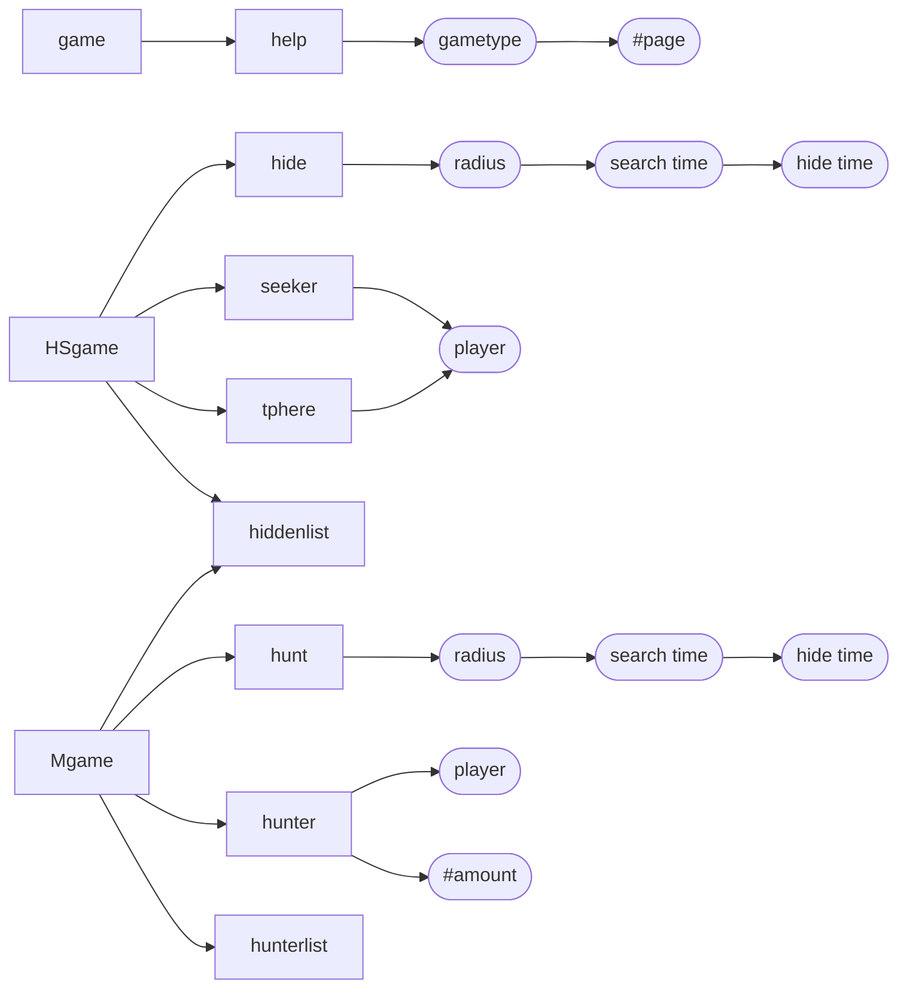
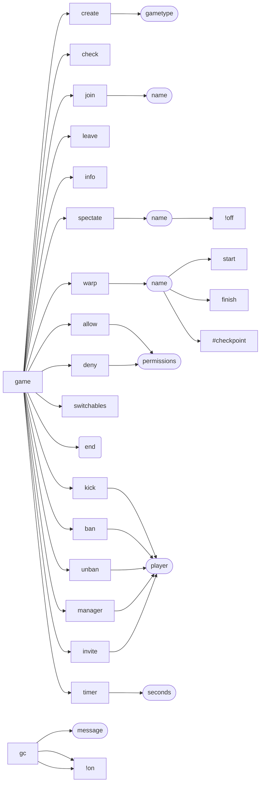
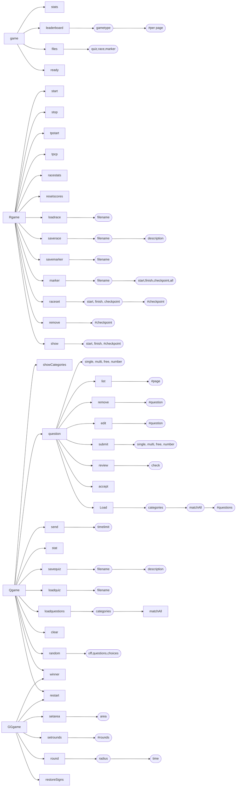

## Backend command tree

```mermaid
graph LR

    game --> help --> A1([gametype]) --> A2([#page])

    HSgame --> hide --> HS2([radius]) --> HS3([search time]) --> HS4([hide time])
    HSgame --> seeker --> HS5([player])
    HSgame --> tphere --> HS5
    HSgame --> hiddenlist

    Mgame --> hunt --> M2([radius]) --> M3([search time]) --> M4([hide time])
    Mgame --> hunter --> M5([player])
    hunter --> M6([#amount])
    Mgame --> hunterlist
    Mgame --> hiddenlist
```
## Shared command tree

```mermaid
graph LR
    
    game --> create --> G0([gametype])
    game --> check
    game --> join --> G1([name])
    game --> leave
    game --> info
    game --> spectate --> G2([name]) --> !off
    game --> warp --> G3([name]) --> start
                      G3         --> finish
                      G3         --> #checkpoint
    game --> allow --> G4([permissions])
    game --> deny --> G4
    game --> switchables
    game --> UNICODE_TEXT(end)
    game --> kick --> G5([player])
    game --> ban --> G5
    game --> unban --> G5
    game --> manager --> G5
    game --> invite --> G5
    game --> timer --> G6([seconds])

    gc --> B1([message])
    gc --> GC[!off]
    gc --> GC[!on]
```

## Proxy command tree

```mermaid
graph LR
    
    game --> stats
    game --> leaderboard --> G1([gametype]) --> G2([#per page])
    game --> files --> G3([quiz,race,marker])
    game --> ready

    Rgame --> start
    Rgame --> stop
    Rgame --> tpstart
    Rgame --> tpcp
    Rgame --> racestats
    Rgame --> resetscores
    Rgame --> loadrace --> R2([filename])
    Rgame --> saverace --> R3([filename]) --> R5([description])
    Rgame --> savemarker --> R6([filename])
    Rgame --> marker --> R7([filename]) --> R8([start,finish,checkpoint,all])
    Rgame --> raceset --> R9([start, finish, checkpoint]) --> R10([#checkpoint])
    Rgame --> R11[remove] --> R12([#checkpoint])
    Rgame --> show --> R13([start, finish, #checkpoint])

    Qgame --> showCategories
    Qgame --> question --> Q2([single, multi, free, number])
              question --> list --> Q3([#page])
              question --> Q4[remove] --> Q5([#question])
              question --> edit --> Q6([#question])
              question --> submit --> Q7([single, multi, free, number])
              question --> review --> Q8([check])
              question --> accept
              question --> Load --> Q9([categories]) --> Q10([matchAll]) --> Q11([#questions])
    Qgame --> send --> Q12([timelimit])
    Qgame --> stat
    Qgame --> savequiz --> Q13([filename]) --> Q14([description])
    Qgame --> loadquiz --> Q15([filename])
    Qgame --> loadquestions --> Q16([categories]) --> matchAll
    Qgame --> clear
    Qgame --> random --> Q18([off,questions,choices])
    Qgame --> winner
    Qgame --> restart

    GGgame --> winner
    GGgame --> restart
    GGgame --> setarea --> GG2([area])
    GGgame --> setrounds --> GG3([#rounds])
    GGgame --> round --> GG4([radius]) --> GG5([time])
    GGgame --> restoreSigns
```